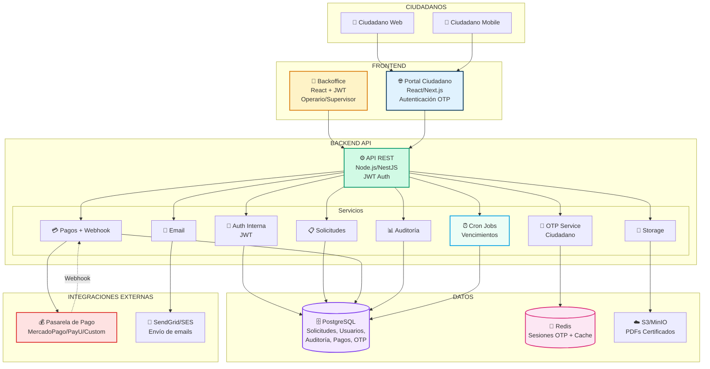
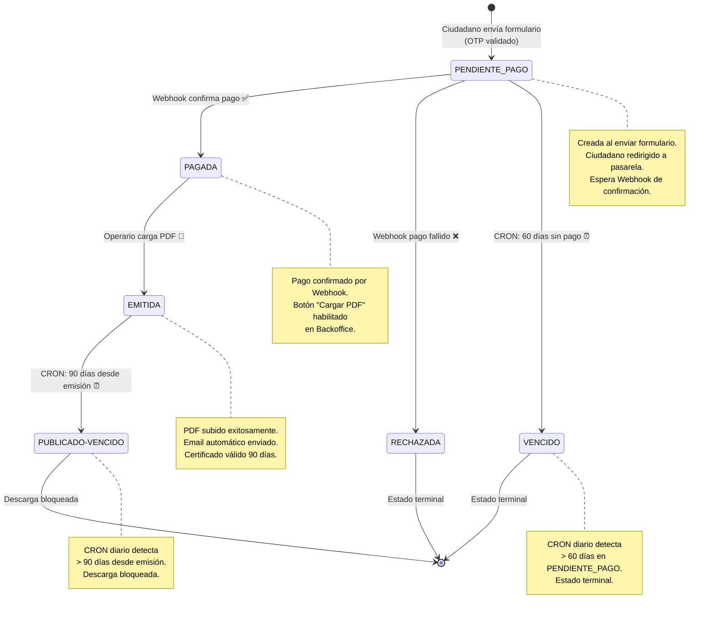
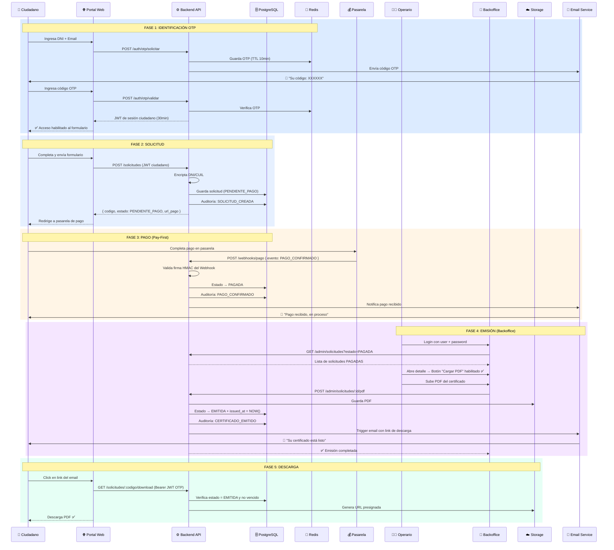
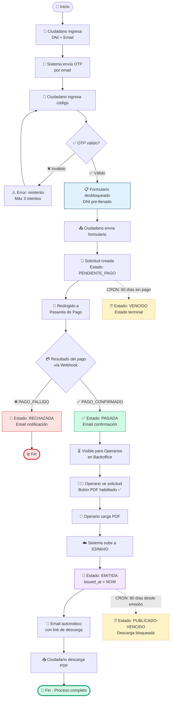
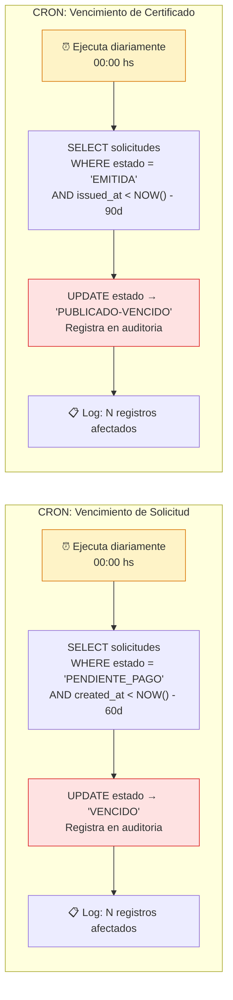
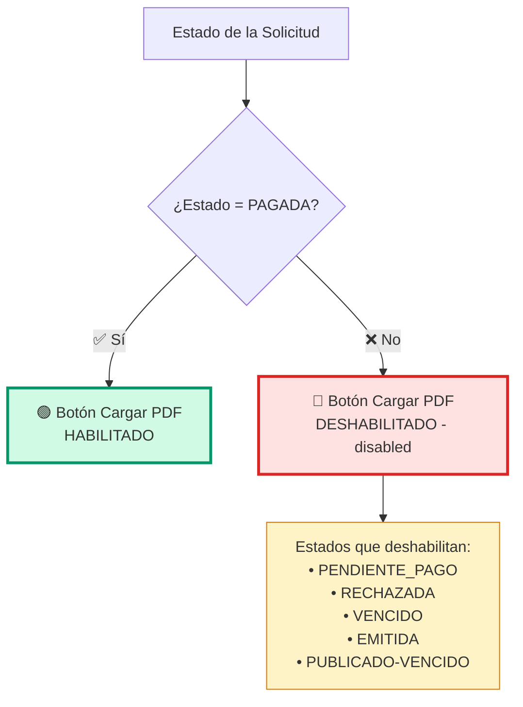
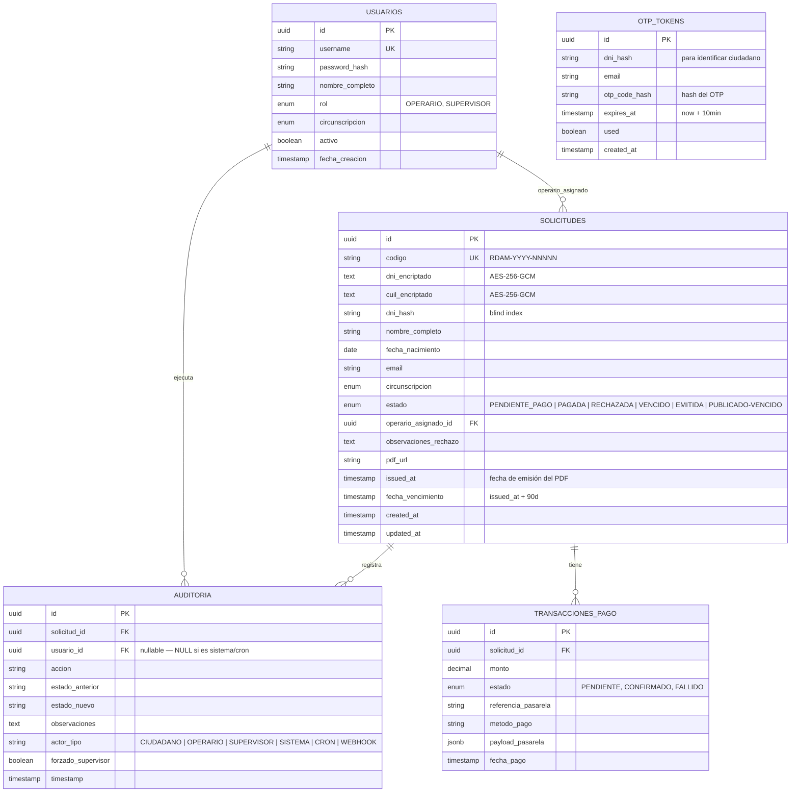
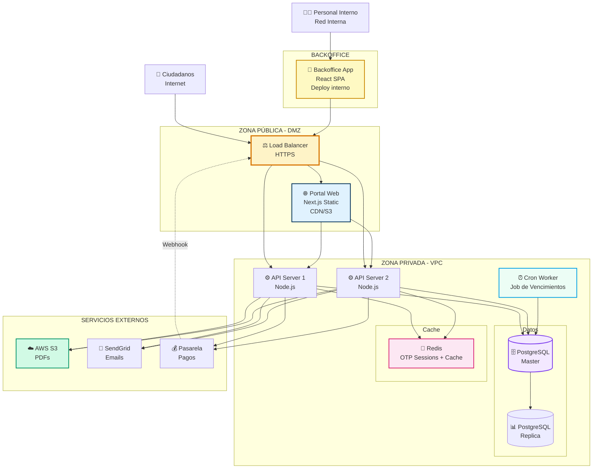

# DIAGRAMAS DE ARQUITECTURA — RDAM
## Poder Judicial de la Provincia de Santa Fe
**Version:** 2.1 - Alineado con ALCANCE v2.1 (TypeORM + JWT/OTP + Pay-First + Cron Jobs)

Estos diagramas están en formato **Mermaid**, que se renderiza automáticamente en:
- GitHub / GitLab / Bitbucket
- Notion / Confluence
- VS Code (con extensión Mermaid Preview)
- [Mermaid Live Editor](https://mermaid.live) para exportar como PNG/SVG

---

## 1. Arquitectura de Componentes



---

## 2. Flujo de Estados de Solicitud

> Estados del ciclo de vida completo. Los estados `EN_REVISION` y `APROBADA` **no existen** en este modelo.



---

## 3. Secuencia del Happy Path (Flujo Completo)



---

## 4. Diagrama de Flujo de Proceso



---

## 5. Diagrama de Cron Jobs (Vencimientos Automáticos)



---

## 6. Diagrama de Habilitación de Controles (Backoffice)



---

## 7. Diagrama de Arquitectura de Datos



---

## 8. Diagrama de Despliegue



---

## 9. Diagrama de Seguridad (Flujo de Datos Sensibles)

```mermaid
graph LR
    subgraph "CIUDADANO"
        C[👤 Ingresa DNI:<br/>'30456789']
    end

    subgraph "FRONTEND"
        F[📱 Portal Web<br/>HTTPS]
    end

    subgraph "BACKEND API"
        API[🔐 API Endpoint]
        ENC[🔒 Encryption Service<br/>AES-256-GCM]
        HASH[#️⃣ Blind Index<br/>SHA-256]
    end

    subgraph "DATABASE"
        DB[(🗄️ PostgreSQL<br/>Encrypted at Rest)]
    end

    C -->|POST /auth/otp/solicitar<br/>{"dni":"30456789","email":"..."}| F
    F -->|TLS 1.3| API
    API --> ENC
    API --> HASH

    ENC -->|dni_encriptado:<br/>'e4a8f3b...'<br/>IV: random| DB
    HASH -->|dni_hash:<br/>'7f9a2c1...'<br/>(salt + dni)| DB

    DB -.Búsqueda por blind index.-> API
    API -.Solo hash,<br/>nunca DNI plano.-> DB

    DB -.Lee encriptado.-> API
    API -.Desencripta solo<br/>en Detalle + JWT.-> VIEW[👁️ Vista Detalle<br/>Operario]

    style C fill:#e0f2fe,stroke:#003057
    style F fill:#d1fae5,stroke:#059669
    style ENC fill:#fee2e2,stroke:#dc2626,stroke-width:3px
    style HASH fill:#fef3c7,stroke:#d97706,stroke-width:3px
    style DB fill:#f3e8ff,stroke:#7c3aed,stroke-width:3px
```

---

## Cómo Usar Estos Diagramas

### En GitHub/GitLab
Los bloques de código Mermaid se renderizan automáticamente. Solo pegá este archivo en tu repo.

### En Notion/Confluence
Copiá el código Mermaid y pegalo en un bloque de código con lenguaje `mermaid`.

### Exportar como Imagen
1. Abrí [Mermaid Live Editor](https://mermaid.live)
2. Pegá el código del diagrama
3. Descargá como PNG o SVG
4. Usalo en presentaciones PowerPoint/Google Slides

### En VS Code
Instalá la extensión **"Markdown Preview Mermaid Support"** y el preview de este archivo mostrará los diagramas renderizados.


---

## Nota v2.1

- Backend oficial: NestJS + TypeORM (PostgreSQL), sin Prisma.
- Seguridad: Passport-JWT (JwtAuthGuard) y control de roles para rutas internas.
- Validacion: class-validator + class-transformer con ValidationPipe global.
- Documentacion viva: Swagger/OpenAPI en /docs.
- Errores API: formato uniforme via GlobalExceptionFilter.

